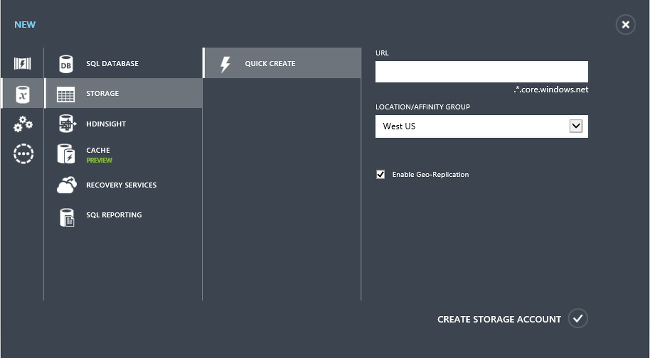
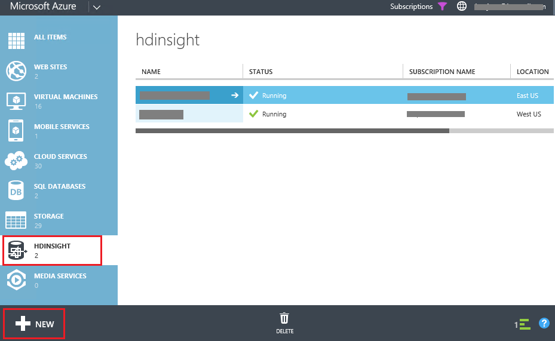
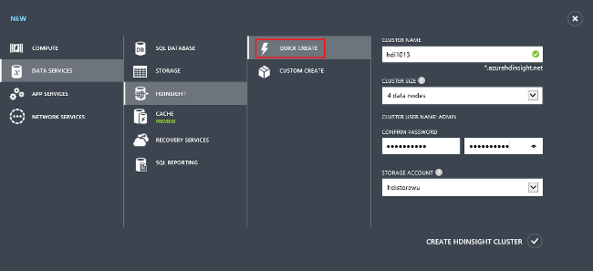
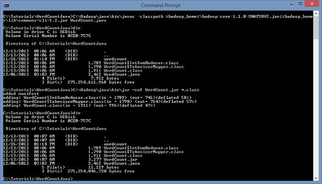
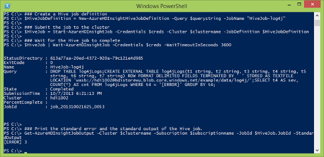
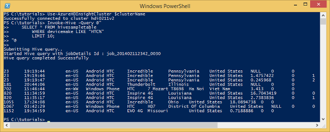

# Getting started with Microsoft Azure HDInsight Service #

HDInsight Service makes [Apache Hadoop](http://hadoop.apache.org/) available as a service in the cloud. It makes the MapReduce software framework available in a simpler, more scalable, and cost efficient Microsoft Azure environment. HDInsight also provides a cost efficient approach to the managing and storing of data. HDInsight Service uses Microsoft Azure Blob Storage as the default file system.

In this tutorial, you will provision an HDInsight cluster using the Microsoft Azure Management Portal, deploy Java MapReduce programs using PowerShell, and then use Hive with HDInsight.

### Prerequisites ###

Before you begin this hands on lab, you must have the following:

- A Microsoft Azure subscription - Starting September 2014, accounts associated with Azure training passes will not have HDInsight available. To use HDInsight, you will need a different account such as the free trial subscription - [Sign up for a free trial](http://aka.ms/WATK-FreeTrial)
- A computer that is running Windows 8, Windows 7, Windows Server 2012, or Windows Server 2008 R2.

---

## Exercises ##

This hands-on lab includes the following exercises:

1. [Set up local environment for running PowerShell](#Exercise1)
1. [Provision an HDInsight cluster](#Exercise2)
1. [Develop Java MapReduce programs for HDInsight](#Exercise3)
1. [Use Hive with HDInsight](#Exercise4)

Estimated time to complete this lab: **30** minutes.

### Excercise 1: Set up local environment for running PowerShell ###

In this exercise, you will use PowerShell Tools for Microsoft Azure HDInsight to run a MapReduce job. It requires the following configuration steps:

1. Install the Microsoft Azure module for Windows PowerShell
1. Install PowerShell Tools for Microsoft Azure HDInsight
1. Configure connectivity to your Microsoft Azure account

For more information, see [Install and Configure PowerShell for HDInsight](http://www.windowsazure.com/en-us/manage/services/hdinsight/install-and-configure-powershell-for-hdinsight/).

####To install Microsoft Azure PowerShell####

1. Open Internet Explorer, and browse to the [Microsoft Azure Downloads](http://www.windowsazure.com/en-us/manage/downloads/) page.
1. Under Windows downloads in the Command line tools section, click Microsoft Azure PowerShell, and then follow the instructions.

####To install and import the PowerShell Tools for Microsoft Azure HDInsight####
1. Open Internet Explorer, and then browse to [Microsoft .NET SDK for Hadoop](http://go.microsoft.com/fwlink/?linkid=325563&clcid=0x409) to download the package.
1. Click Run from the bottom of the page to run the installation package.
1. Open Microsoft Azure PowerShell. For instructions of opening a Microsoft Azure PowerShell console window, see Install and Configure PowerShell for HDInsight.

Your Microsoft Azure subscription information is used by the cmdlets to connect to your account. This information can be obtained from Microsoft Azure in a publishsettings file. The publishsettings file can then be imported as a persistent local config setting that the command-line interface will use for subsequent operations. You only need to import your publishsettings once.

Notes: The publishsettings file contains sensitive information. It is recommended that you delete the file or take additional steps to encrypt the user folder that contains the file. On Windows, modify the folder properties or use BitLocker.
 
####To download and import publishsettings####
1. Sign in to the [Microsoft Azure Management Portal](https://manage.windowsazure.com/) using the credentials for your Microsoft Azure account.

1. Open Microsoft Azure PowerShell. For instructions of opening Microsoft Azure PowerShell console window, see [Install and Configure PowerShell for HDInsight](http://www.windowsazure.com/en-us/manage/services/hdinsight/install-and-configure-powershell-for-hdinsight/).

1. Run the following command to download the publishsettings file.

    <pre>
    Get-AzurePublishSettingsFile
    </pre>

    The command opens an Internet Explorer window and a web page. The URL is *https://manage.Windowsazure.com/publishsettings/index?client=powershell*.

1. When prompted, download and save the publishing profile and note the path and name of the .publishsettings file. This information is required when you run the Import-AzurePublishSettingsFile cmdlet to import the settings. The default location and file name format is:
    <pre>
    C:\Users\&lt;UserProfile&gt;\Desktop\[MySubscription-…]-downloadDate-credentials.publishsettings
    </pre>
1. From the Microsoft Azure PowerShell window, run the following command to import the publishsettings file:

    <pre>
    Import-AzurePublishSettingsFile &lt;PublishSettings-file&gt;
    </pre>

    For example:

    <pre>
    Import-AzurePublishSettingFile "C:\Users\JohnDole\Desktop\Azure-8-30-2013-credentials.publishsettings"
    </pre>

1. Once the file is imported, you can use the following command to list your subscriptions:

    <pre>
    Get-AzureSubscription
    </pre>

1. When you have multiple subscriptions, you can use the following command to make a subscription the current subscription:

    <pre>
    Select-AzureSubscription -SubscriptionName &lt;SubscriptionName&gt;
    </pre>

### Excercise 2: Provision an HDInsight cluster ###

The HDInsight provision process requires a Microsoft Azure Storage account to be used as the default file system. The storage account must be located in the same data center as the HDInsight Service compute resources. Currently, you can only provision HDInsight clusters in the following data centers:

- US East
- US West
- Europe North

You must choose one of the two data centers for your Microsoft Azure Storage account.

#### To create a Microsoft Azure Storage account ####
1. Sign in to the Microsoft Azure Management Portal.
1. Click **NEW** on the lower left corner, point to **DATA SERVICES**, point to **STORAGE**, and then click **QUICK CREATE**.

    

    _Create Storage Account_

1. Enter **URL** and **LOCATION/AFFINITY** GROUP, and then click **CREATE STORAGE ACCOUNT**. You will see the new storage account in the storage list.

1. Wait until the **STATUS** of the new storage account is changed to **Online**.
1. Click the new storage account from the list to select it.
1. Click **MANAGE ACCESS KEYS** from the bottom of the page.
1. Make a note of the **STORAGE ACCOUNT NAME** and the **PRIMARY ACCESS KEY**. You will need them later in the tutorial.

For the detailed instructions, see [How to Create a Storage Account](http://www.windowsazure.com/en-us/manage/services/storage/how-to-create-a-storage-account/) and [Using Microsoft Azure Blob Storage with HDInsight](http://www.windowsazure.com/en-us/manage/services/hdinsight/howto-blob-store/).

#### To provision an HDInsight cluster ####
1. Sign in to the Microsoft Azure Management Portal.

1. Click **HDInsight** on the left to list the status of the clusters in your account. In the following screenshot, there is no existing HDInsight cluster.

    

    _Create HDInsight_

1. Click **NEW** on the lower left side, click Data Services, click **HDInsight**, and then click **Quick Create**.

    

    _Quick Create HDInsight_

1. Enter or select the following values:
    - **Cluster Name:** Name of the cluster 
    - **Cluster Size:** Number of data nodes you want to deploy. The default value is 4. But 8, 16 and 32 data node clusters are also available on the dropdown menu. Any number of data nodes may be specified when using theCustom Createoption. Pricing details on the billing rates for various cluster sizes are available. Click the symbol just above the dropdown box and follow the link on the pop up. 
    - **Password (cluster admin):** The password for the accountadmin. The cluster user name is specified to be "admin" by default when using the Quick Create option. This can only be changed by using the **Custom Create** wizard. The password field must be at least 10 characters and must contain an uppercase letter, a lowercase letter, a number, and a special character. 
    - **Storage Account:** Select the storage account you created from the dropdown box. Once as Storage account is chosen, it cannot be changed. If the storage account is removed, the cluster will no longer be available for use. The HDInsight cluster location will be the same as the storage account. 

1. Click **Create HDInsight Cluster** on the lower right. The cluster is now provisioned and when it will be available when its status is listed as Running.

For information on using the **CUSTOM CREATE** option, see [Provision HDInsight Clusters](http://www.windowsazure.com/en-us/manage/services/hdinsight/provision-hdinsight-clusters/).

### Excercise 3: Develop Java MapReduce programs for HDInsight ###

#### Develop a word counting MapReduce program in Java ####
1. Now you have an HDInsight cluster provisioned. The next step is to develop Java MapReduce programs and run it on your HDInsight. We will write a very simple program called **WordCount**. Word counting is a simple application that counts the occurrences of each word in a given input set. To write the word counting MapReduce job in Java, open Notepad or other editors and copy/paste the following program into the text editor.

    <pre>
    package org.apache.hadoop.examples;

    import java.io.IOException;
    import java.util.StringTokenizer;
    import org.apache.hadoop.conf.Configuration;
    import org.apache.hadoop.fs.Path;
    import org.apache.hadoop.io.IntWritable;
    import org.apache.hadoop.io.Text;
    import org.apache.hadoop.mapreduce.Job;
    import org.apache.hadoop.mapreduce.Mapper;
    import org.apache.hadoop.mapreduce.Reducer;
    import org.apache.hadoop.mapreduce.lib.input.FileInputFormat;
    import org.apache.hadoop.mapreduce.lib.output.FileOutputFormat;
    import org.apache.hadoop.util.GenericOptionsParser;
    
    public class WordCount {
    
      public static class TokenizerMapper 
           extends Mapper&lt;Object, Text, Text, IntWritable&gt;{
    
        private final static IntWritable one = new IntWritable(1);
        private Text word = new Text();
    
        public void map(Object key, Text value, Context context
                        ) throws IOException, InterruptedException {
          StringTokenizer itr = new StringTokenizer(value.toString());
          while (itr.hasMoreTokens()) {
            word.set(itr.nextToken());
            context.write(word, one);
          }
        }
      }
    
      public static class IntSumReducer 
           extends Reducer&lt;Text,IntWritable,Text,IntWritable&gt;{
        private IntWritable result = new IntWritable();
    
        public void reduce(Text key, Iterable&lt;IntWritable&gt; values, 
                           Context context
                           ) throws IOException, InterruptedException {
          int sum = 0;
          for (IntWritable val : values) {
            sum += val.get();
          }
          result.set(sum);
          context.write(key, result);
        }
      }
    
      public static void main(String[] args) throws Exception {
        Configuration conf = new Configuration();
        String[] otherArgs = new GenericOptionsParser(conf, args).getRemainingArgs();
        if (otherArgs.length != 2) {
          System.err.println("Usage: wordcount &lt;in&gt; &lt;out&gt;");
          System.exit(2);
        }
        Job job = new Job(conf, "word count");
        job.setJarByClass(WordCount.class);
        job.setMapperClass(TokenizerMapper.class);
        job.setCombinerClass(IntSumReducer.class);
        job.setReducerClass(IntSumReducer.class);
        job.setOutputKeyClass(Text.class);
        job.setOutputValueClass(IntWritable.class);
        FileInputFormat.addInputPath(job, new Path(otherArgs[0]));
        FileOutputFormat.setOutputPath(job, new Path(otherArgs[1]));
        System.exit(job.waitForCompletion(true) ? 0 : 1);
      }
    }
    </pre>

    Notice the package name is **org.apache.hadoop.examples** and the class name is **WordCount**. You will use the names when you submit the MapReduce job.

1. Save the file to any places on your computer with file name **WordCount.java**. Next you need to compile the program. If you are using windows, you can install HDInsight Emulator to compile and test your application. You can find more details from [Get started with the HDInsight Emulator](http://azure.microsoft.com/en-us/documentation/articles/hdinsight-get-started-emulator/). If you are using Linux or Mac, you need to install Java SDK to compile your java code.

1. We presume that you have already installed Java SDK and we use the following command to comple the java code. The 2 jar files **commons-cli-1.2.jar** and **hadoop-core-1.1.0-SNAPSHOT.jar** can be found under **Azure-training-course\Day 2\6. Big Data analytics using Hadoop and SQL and no-SQL\hadoop\jar**.

    <pre>
    [JDK_FOLDER]\javac -classpath hadoop-core-1.1.0-SNAPSHOT.jar;commons-cli-1.2.jar WordCount.java
    </pre>

    Please ensure you add correct folder for [JDK_FOLDER] and **commons-cli-1.2.jar** and **hadoop-core-1.1.0-SNAPSHOT.jar** are in the same folder of your WordCount.java source code.
    
1. The compiler creates 3 class files in the current folder. Then we run the following command to create a jar file:
    <pre>
    [JDK_FOLDER]\jar -cvf WordCount.jar *.class
    </pre>

    The command creates a WordCount.jar file in the current folder.    
    

    If you are using Windows, you can install HDInsight Emulator to compile and test your application. You can find more details from [Get started with the HDInsight Emulator](http://azure.microsoft.com/en-us/documentation/articles/hdinsight-get-started-emulator/).

#### Upload data to Azure Blob storage ####

        
Azure HDInsight uses Azure Blob storage for data storage. When an HDInsight cluster is provisioned, an Azure Blob storage container is used to store the system files. You can use either this default container or a different container (either on the same Azure storage account or a different storage account located on the same data center as the cluster) for storing the data files. 

In this tutorial, you can use the storage account you created in [Exercise 2](#Exercise2) to save the data files and the MapReduce application. The data files are the text files in the **Azure-training-course\Day 2\6. Big Data analytics using Hadoop and SQL and no-SQL\hadoop\txt** directory on your workstation.

1. Open Azure PowerShell. Set the variables, and then run the commands:

    <pre>
    $subscriptionName = "[AzureSubscriptionName]"
    $storageAccountName_Data = "[AzureStorageAccountName]"  
    $containerName_Data = "[ContainerName]"
    $location = "[MicrosoftDataCenter]"  # For example, "East US"
    </pre>

    The $subscripionName is associated with your Azure subscription. You must name the$storageAccountName_Data and $containerName_Data. For the naming restrictions, see Naming and Referencing Containers, Blobs, and Metadata. 

1. Run the following commands to select the subscription and verify the storage account and the container:

    <pre>

	# Select Azure subscription
    Select-AzureSubscription $subscriptionName

    Get-AzureStorageAccount -StorageAccountName $storageAccountName_Data
    Get-AzureStorageContainer -Context $destContext
    </pre>

1. Then run the following commands to upload text files from the training txt directory.

    <pre>
    $localFolder = "c:\Azure-training-course\Day 2\6. Big Data analytics using Hadoop and SQL and no-SQL\hadoop\txt"
    $destFolder = "WordCount/Input"
    $filesAll = Get-ChildItem $localFolder
    # Copy the file from local workstation to the Blob container        
    foreach ($file in $filesAll){
    
        $fileName = "$localFolder\$file"
        $blobName = "$destFolder/$file"    
        write-host "Copying $fileName to $blobName"    
        Set-AzureStorageBlobContent -File $fileName -Container $containerName_Data -Blob $blobName -Context $destContext
    }
    </pre>

    Notice the source file folder is the txt folder under **Azure-training-course\Day 2\6. Big Data analytics using Hadoop and SQL and no-SQL\hadoop\**, and the destination folder is **WordCount/Input**.

1. Run the following command to list the uploaded files:

    <pre>
    # List the uploaded files in the Blob storage container
    Write-Host "The Uploaded data files:" -BackgroundColor Green
    Get-AzureStorageBlob -Container $containerName_Data -Context $destContext -Prefix $destFolder
    </pre>

    You should see about 8 text data files.

1. Then we continue to upload the word counting application we compiled.
    <pre>
    $jarFile = "Azure-training-course\Day 2\6. Big Data analytics using Hadoop and SQL and no-SQL\hadoop\src\WordCount.jar"
    $blobFolder = "WordCount/jars"

    Set-AzureStorageBlobContent -File $jarFile -Container $containerName_Data -Blob "$blobFolder/WordCount.jar" -Context $destContext

    Write-Host "The Uploaded application file:" -BackgroundColor Green
    Get-AzureStorageBlob -Container $containerName_Data -Context $destContext -Prefix $blobFolder
    </pre>

    Notice the destination folder is WordCount/jars and you should see the jar file listed there.

#### Run the MapReduce job on Azure HDInsight ####

Run the MapReduce job on Azure HDInsight

The following PowerShell script performs the following tasks:

1. provision an HDInsight cluster
    1. create a storage account that will be used as the default HDInsight cluster file system
    1. create a Blob storage container 
    1. create an HDInsight cluster
1. submit the MapReduce job
    1. create a MapReduce job definition
    1. submit a MapReduce job
    1. wait for the job to complete
    1. display standard error
    1. display standard output
1. delete the cluster
    1. delete the HDInsight cluster
    1. delete the storage account used as the default HDInsight cluster file system

1. To run the PowerShell script, open Notepad and copy/paste the following code:

    <pre>
    # The storage account and the HDInsight cluster variables
    $subscriptionName = "[AzureSubscriptionName]"
    $serviceNameToken = "[ServiceNameTokenString]"
    $location = "[MicrosoftDataCenter]"    ###  must match the data storage account location
    $clusterNodes = [NumberOFNodesInTheCluster]
    
    $storageAccountName_Data = "[TheDataStorageAccountName]"
    $containerName_Data = "[TheDataBlobStorageContainerName]"
    
    $clusterName = $serviceNameToken + "hdicluster"
    
    $storageAccountName_Default = $serviceNameToken + "hdistore"
    $containerName_Default =  $serviceNameToken + "hdicluster"
    
    # The MapReduce job variables
    $jarFile = "wasb://$containerName_Data@$storageAccountName_Data.blob.core.windows.net/WordCount/jars/WordCount.jar"
    $className = "org.apache.hadoop.examples.WordCount"
    $mrInput = "wasb://$containerName_Data@$storageAccountName_Data.blob.core.windows.net/WordCount/Input/"
    $mrOutput = "wasb://$containerName_Data@$storageAccountName_Data.blob.core.windows.net/WordCount/Output/"
    $mrStatusOutput = "wasb://$containerName_Data@$storageAccountName_Data.blob.core.windows.net/WordCount/MRStatusOutput/"
    
    # Create a PSCredential object. The username and password are hardcoded here.  You can change them if you want.
    $password = ConvertTo-SecureString "Pass@word1" -AsPlainText -Force
    $creds = New-Object System.Management.Automation.PSCredential ("Admin", $password) 
    
    Select-AzureSubscription $subscriptionName
    
    #=============================
    # Create a storage account used as the default file system
    Write-Host "Create a storage account" -ForegroundColor Green
    New-AzureStorageAccount -StorageAccountName $storageAccountName_Default -location $location
    
    #=============================
    # Create a Blob storage container used as teh default file system
    Write-Host "Create a Blob storage container" -ForegroundColor Green
    $storageAccountKey_Default = Get-AzureStorageKey $storageAccountName_Default | %{ $_.Primary }
    $destContext = New-AzureStorageContext –StorageAccountName $storageAccountName_Default –StorageAccountKey $storageAccountKey_Default
    
    New-AzureStorageContainer -Name $containerName_Default -Context $destContext
    
    #=============================
    # Create an HDInsight cluster
    Write-Host "Create an HDInsight cluster" -ForegroundColor Green
    $storageAccountKey_Data = Get-AzureStorageKey $storageAccountName_Data | %{ $_.Primary }
    
    $config = New-AzureHDInsightClusterConfig -ClusterSizeInNodes $clusterNodes |
        Set-AzureHDInsightDefaultStorage -StorageAccountName "$storageAccountName_Default.blob.core.windows.net" -StorageAccountKey $storageAccountKey_Default -StorageContainerName $containerName_Default |
        Add-AzureHDInsightStorage -StorageAccountName "$storageAccountName_Data.blob.core.windows.net" -StorageAccountKey $storageAccountKey_Data
    
    New-AzureHDInsightCluster -Name $clusterName -Location $location -Credential $creds -Config $config
    
    #=============================
    # Create a MapReduce job definition
    Write-Host "Create a MapReduce job definition" -ForegroundColor Green
    $mrJobDef = New-AzureHDInsightMapReduceJobDefinition -JobName mrWordCountJob  -JarFile $jarFile -ClassName $className -Arguments $mrInput, $mrOutput -StatusFolder /WordCountStatus
    
    #=============================
    # Run the MapReduce job
    Write-Host "Run the MapReduce job" -ForegroundColor Green
    $mrJob = Start-AzureHDInsightJob -Cluster $clusterName -JobDefinition $mrJobDef 
    Wait-AzureHDInsightJob -Job $mrJob -WaitTimeoutInSeconds 3600 
    
    Get-AzureHDInsightJobOutput -Cluster $clusterName -JobId $mrJob.JobId -StandardError 
    Get-AzureHDInsightJobOutput -Cluster $clusterName -JobId $mrJob.JobId -StandardOutput
    
    #=============================
    # Delete the HDInsight cluster
    Write-Host "Delete the HDInsight cluster" -ForegroundColor Green
    Remove-AzureHDInsightCluster -Name $clusterName  
    
    # Delete the default file system storage account
    Write-Host "Delete the storage account" -ForegroundColor Green
    Remove-AzureStorageAccount -StorageAccountName $storageAccountName_Default
    </pre>

1. Set the first six variables in the script. $serviceNameToken will be used for the HDInsight cluster name, the default storage account name, and the default Blob storage container name. Because the service name must be between 3 and 24 characters, and the script append string with up to 10 character string to the names, you must limit the string to 14 or less characters. And the $serviceNameToken must use lower case. $storageAccountName_Data and $containerName_Data are the storage account and container that are used for storing the data files and the application. $location must match the data storage account location.

1. Review the rest of the variables.
1. Save the script file.
1. Open Azure PowerShell.
1. Run the following command to set the execution policy to remotesigned:
    <pre>
    PowerShell -File &lt;FileName&gt; -ExecutionPolicy RemoteSigned
    </pre>

1. When prompted, enter username and password for the HDInsight cluster. Because you will delete the cluster at the end of the script and you will not need the username and password anymore, the username and password can be any strings. If you don't want to get prompted for the credentials, see [Working with Passwords, Secure Strings and Credentials in Windows PowerShell](http://social.technet.microsoft.com/wiki/contents/articles/4546.working-with-passwords-secure-strings-and-credentials-in-windows-powershell.aspx).

#### Retrieve the MapReduce job output ####

This section shows you how to download and display the output. For the information on displaying the results on Excel, see [Connect Excel to HDInsight with the Microsoft Hive ODBC Driver](http://azure.microsoft.com/en-us/documentation/articles/hdinsight-connect-excel-hive-ODBC-driver/), and [Connect Excel to HDInsight with Power Query](http://azure.microsoft.com/en-us/documentation/articles/hdinsight-connect-excel-power-query/).

1. Open Azure PowerShell window.
1. Change directory to **Azure-training-course\Day 2\6. Big Data analytics using Hadoop and SQL and no-SQL\hadoop**. The default Azure PowerShell folder is **C:\Windows\System32\WindowsPowerShell\v1.0**. The cmdlets you will run will download the output file to the current folder. You don't have permissions to download the files to the system folders.

1. Run the following commands to set the values:
    <pre>
    $subscriptionName = "[AzureSubscriptionName]"
    $storageAccountName_Data = "[TheDataStorageAccountName]"
    $containerName_Data = "[TheDataBlobStorageContainerName]"
    $blobName = "WordCount/Output/part-r-00000"
    </pre>

1. Run the following commands to create an Azure storage contect object: 
    <pre>
    Select-AzureSubscription $subscriptionName
    $storageAccountKey = Get-AzureStorageKey $storageAccountName_Data | %{ $_.Primary }
    $storageContext = New-AzureStorageContext –StorageAccountName $storageAccountName_Data –StorageAccountKey $storageAccountKey  
    </pre>

1. Run the following commands to download and display the output:
    <pre>
    Get-AzureStorageBlobContent -Container $containerName_Data -Blob $blobName -Context $storageContext -Force
    cat "./$blobName" | findstr "there"
    </pre>

After the job is completed, you have the options to export the data to SQL Server or Azure SQL database using [Sqoop](http://azure.microsoft.com/en-us/documentation/articles/hdinsight-use-sqoop/), or to export the data to Excel.

 
### Excercise 4: Use Hive with HDInsight ###

[Apache Hive](http://hive.apache.org/) provides a means of running MapReduce job through an SQL-like scripting language, called _HiveQL_, which can be applied towards summarization, querying, and analysis of large volumes of data. In this article, you will use HiveQL to query the data in an Apache log4j log file and report basic statistics. 

#### The Hive usage case ####

Databases are appropriate when managing smaller sets of data for which low latency queries are possible. However, when it comes to big data sets that contain terabytes of data, traditional SQL databases are often not an ideal solution. Database administrators have habitually scaling up to deal with these larger data sets, buying bigger hardware as database load increased and performance degraded. 

Hive solves the problems associated with big data by allowing users to scale out when querying large data sets. Hive queries data in parallel across multiple nodes using MapReduce, distributing the database across on an increasing number of hosts as load increases.

Hive and HiveQL also offer an alternative to writing MapReduce jobs in Java when querying data. It provides a simple SQL-like wrapper that allows queries to be written in HiveQL that are then compiled to MapReduce for you by HDInsight and run on the cluster.

Hive also allows programmers who are familiar with the MapReduce framework to plug in custom mappers and reducers to perform more sophisticated analysis that may not be supported by the built-in capabilities of the HiveQL language. 

Hive is best suited for the batch processing of large amounts of immutable data (such as web logs). It is not appropriate for transaction applications that need very fast response times, such as database management systems. Hive is optimized for scalability (more machines can be added dynamically to the Hadoop cluster), extensibility (within the MapReduce framework and with other programming interfaces), and fault-tolerance. Latency is not a key design consideration. 

Generally, applications save errors, exceptions and other coded issues in a log file, so administrators can use the data in the log files to review problems that may arise and to generate metrics that are relevant to errors or other issues like performance. These log files usually get quite large in size and contain a wealth of data that must be processed and mined for intelligence on the application. 

Log files are therefore a paradigmatic example of big data. HDInsight provides a Hive data warehouse system that facilitates easy data summarization, ad-hoc queries, and the analysis of these big datasets stored in Hadoop compatible file systems such as Azure Blob Storage.

#### Upload data files to the Blob storage ####

HDInsight uses Azure Blob storage container as the default file system. For more information, see [Use Azure Blob Storage with HDInsight](http://azure.microsoft.com/en-us/manage/services/hdinsight/howto-blob-store). 

In this demo, you use a log4j sample file distributed with the HDInsight cluster that is stored in _\example\data\sample.log_. Each log inside the file consists of a line of fields that contains a [LOG LEVEL] field to show the type and the severity. For example:
<pre>
2012-02-03 20:26:41 SampleClass3 [ERROR] verbose detail for id 1527353937 
</pre>

To access files, use the following syntax: 
<pre>
wasb://[containerName]@[AzureStorageName].blob.core.windows.net
</pre>

For example:
<pre>
wasb://mycontainer@mystorage.blob.core.windows.net/example/data/sample.log
</pre>

replace _mycontainer_ with the container name, and _mystorage_ with the Blob storage account name. 

Because the file is stored in the default file system, you can also access the file using the following:
<pre>
wasb:///example/data/sample.log
/example/data/sample.log
</pre>

To generate your own log4j files, use the [Apache Log4j](http://en.wikipedia.org/wiki/Log4j)logging utility. For information on uploading data to Azure Blob Storage, see [Upload Data to HDInsight](http://azure.microsoft.com/en-us/manage/services/hdinsight/howto-upload-data-to-hdinsight/).

#### Run Hive queries using PowerShell ####

In the last section, you uploaded a log4j file called sample.log to the default file system container. In this section, you will run HiveQL to create a hive table, load data to the hive table, and then query the data to find out how many error logs there were.

Hive queries can be run in PowerShell either using the **Start-AzureHDInsightJob** cmdlet or the **Invoke-Hive **cmdlet

To run the Hive queries using **Start-AzureHDInsightJob**, in PowerShell

1. Run the following command to connect to your Azure subscription:
    <pre>
    Add-AzureAccount
    </pre>

    You will be prompted to enter your Azure account credentials.

1. Set the variables in the following script and run it:

    <pre>
    # Provide Azure subscription name, and the Azure Storage account and container that is used for the default HDInsight file system.
    $subscriptionName = "[SubscriptionName]"
    $storageAccountName = "[AzureStorageAccountName]"
    $containerName = "[AzureStorageContainerName]"
    
    # Provide HDInsight cluster name Where you want to run the Hive job
    $clusterName = "[HDInsightClusterName]"
    </pre>

1. Run the following script to define the HiveQL queries:

    <pre>
    # HiveQL queries
    # Use the internal table option. 
    $queryString = "DROP TABLE log4jLogs;" +
                   "CREATE TABLE log4jLogs(t1 string, t2 string, t3 string, t4 string, t5 string, t6 string, t7 string) ROW FORMAT DELIMITED FIELDS TERMINATED BY ' ';" +
                   "LOAD DATA INPATH 'wasb://$containerName@$storageAccountName.blob.core.windows.net/example/data/sample.log' OVERWRITE INTO TABLE log4jLogs;" +
                   "SELECT t4 AS sev, COUNT(*) AS cnt FROM log4jLogs WHERE t4 = '[ERROR]' GROUP BY t4;"
    
    # Use the external table option. 
    $queryString = "DROP TABLE log4jLogs;" +
                    "CREATE EXTERNAL TABLE log4jLogs(t1 string, t2 string, t3 string, t4 string, t5 string, t6 string, t7 string) ROW FORMAT DELIMITED FIELDS TERMINATED BY ' ' STORED AS TEXTFILE LOCATION 'wasb://$containerName@$storageAccountName.blob.core.windows.net/example/data/';" +
                    "SELECT t4 AS sev, COUNT(*) AS cnt FROM log4jLogs WHERE t4 = '[ERROR]' GROUP BY t4;"
    </pre>

    The LOAD DATA HiveQL command will result in moving the data file to the \hive\warehouse\ folder. The DROP TABLE command will delete the table and the data file. If you use the internal table option and want to run the script again, you must upload the sample.log file again. If you want to keep the data file, you must use the CREATE EXTERNAL TABLE command as shown in the script.

    You can also use the external table for the situation where the data file is located in a different container or storage account.

    Use the DROP TABLE first in case you run the script again and the log4jlogs table already exists.

1. Run the following script to create a Hive job definition:

    <pre>
    # Create a Hive job definition 
    $hiveJobDefinition = New-AzureHDInsightHiveJobDefinition -Query $queryString 
    </pre>

    You can also use the -File switch to specify a HiveQL script file on HDFS.

1. Run the following script to submit the Hive job:

    <pre>
    # Submit the job to the cluster 
    Select-AzureSubscription $subscriptionName
    $hiveJob = Start-AzureHDInsightJob -Cluster $clusterName -JobDefinition $hiveJobDefinition
    </pre>

1. Run the following script to wait for the Hive job to complete:

    <pre>
    # Wait for the Hive job to complete
    Wait-AzureHDInsightJob -Job $hiveJob -WaitTimeoutInSeconds 3600
    </pre>

1. Run the following script to print the standard output:

    <pre>
    # Print the standard error and the standard output of the Hive job.
    Get-AzureHDInsightJobOutput -Cluster $clusterName -JobId $hiveJob.JobId -StandardOutput
    </pre>

    

    _Hive Powershell_

    The results is:
    <pre>
    [ERROR] 3
    </pre>

1. You can also submit Hive queries using **Invoke-Hive**, run the following script to invoke HiveQL queries:

    <pre>
    Use-AzureHDInsightCluster $clusterName 
    $response = Invoke-Hive -Query @"
        SELECT * FROM hivesampletable
            WHERE devicemake LIKE "HTC%"
            LIMIT 10; 
    "@
    
    Write-Host $response
    </pre>

    

    _Hive Powershell Output_

1. For longer HiveQL queries, it is recommended to use PowerShell Here-Strings or HiveQL script file. The following samples shows how to use the Invoke-Hive cmdlet to run a HiveQL script file. The HiveQL script file must be uploaded to WASB.
    <pre>
    Invoke-Hive -File "wasb://&lt;ContainerName&gt;@&lt;StorageAccountName&gt;/&lt;Path&gt;/query.hql"
    </pre>

    For more information about Here-Strings, see Using [Windows PowerShell Here-Strings](http://technet.microsoft.com/en-us/library/ee692792.aspx).

----

## Summary ##

By completing this hands-on lab you learned the following:

1. [Set up local environment for running PowerShell](#Exercise1)
1. [Provision an HDInsight cluster](#Exercise2)
1. [Develop Java MapReduce programs for HDInsight](#Exercise3)
1. [Use Hive with HDInsight](#Exercise4)

Copyright 2014 Microsoft Corporation. All rights reserved. 
Except where otherwise noted, these materials are licensed under the terms of the Apache License, Version 2.0. You may use it according to the license as is most appropriate for your project on a case-by-case basis. The terms of this license can be found in [http://www.apache.org/licenses/LICENSE-2.0](http://www.apache.org/licenses/LICENSE-2.0).
